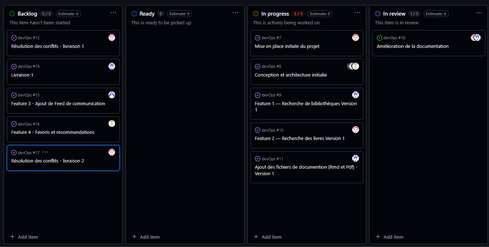
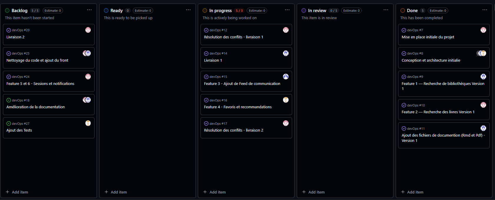
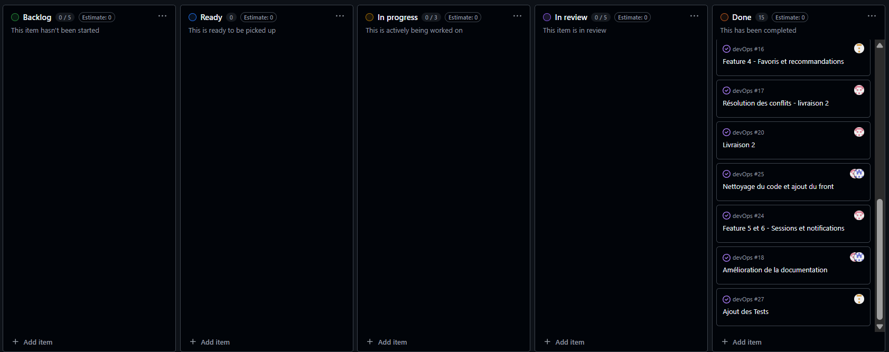
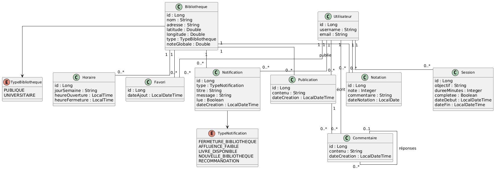
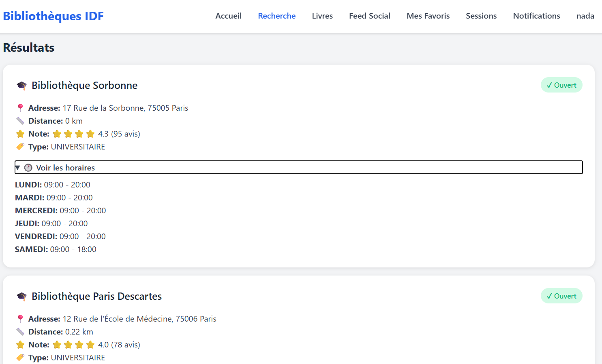
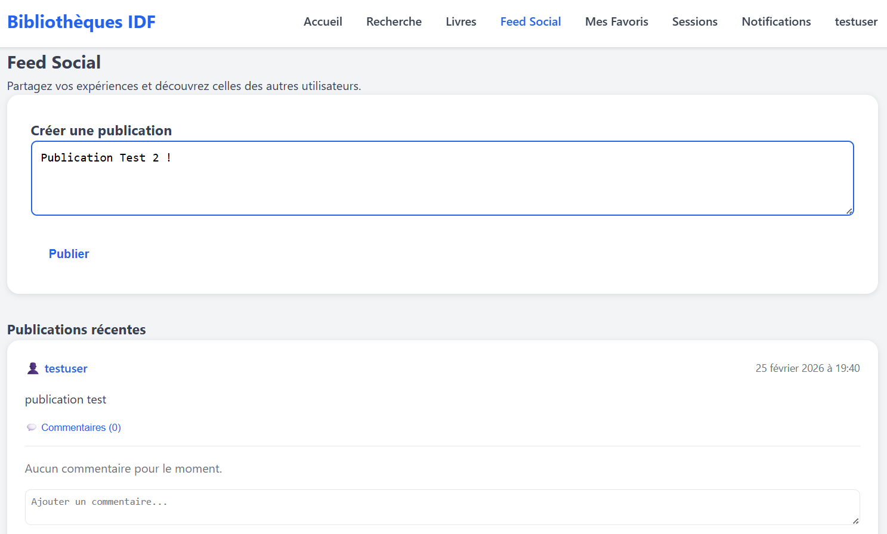
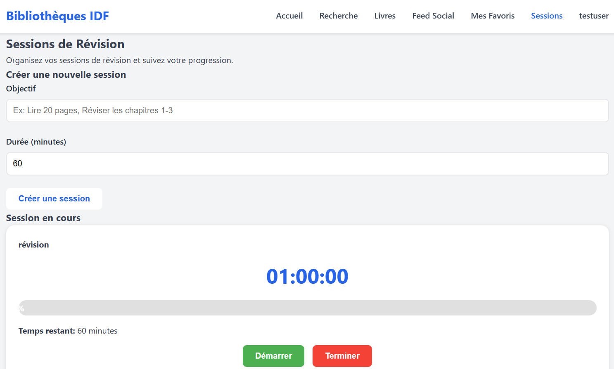

```{r setup, include=FALSE}
knitr::opts_chunk$set(echo = TRUE,  fig.align = "center",
  out.width = "70%")

```

\begin{titlepage}
    \centering
    \vspace*{1cm}

    {\LARGE \textbf{Documentation du projet DevOps \\[0.3cm]Application Bibliothèques} \par}

    \vspace{2cm}

    {\large
    KACI Lilia \\[0.3cm]
    BOUSSETTA Nada\\[0.3cm]
    ELHADJ MIMOUNE Nour El Islem\\[0.3cm]
    AFOUCHAL Assia
    \par}

    \vfill

    {\large 
    M1 MIAGE APP
    \\[0.3cm] 2025-2026}

\end{titlepage}

\newpage

# Introduction

Le projet vise à développer une application centralisant les bibliothèques d’Île-de-France afin de faciliter l’accès à leurs ressources. 

Elle permet aux utilisateurs de consulter les bibliothèques disponibles autour de leur position, de rechercher des livres spécifiques, de connaître les horaires et autres informations utiles. 

L’application inclut également un espace de communication où les utilisateurs peuvent partager des publications et commenter.

# Qui ?

Cette application s’adresse à toute personne intéressée par les bibliothèques et la lecture : bibliophiles, étudiants, chercheurs ou toute personne recherchant un espace calme pour travailler, lire ou étudier. 

Grâce à la géolocalisation, l’utilisateur peut indiquer sa position et l’application lui propose les bibliothèques les plus proches. 

Elle est également utile pour rechercher un livre précis ou découvrir de nouvelles bibliothèques à proximité.

Pour mieux comprendre ce qui rend une bibliothèque attractive, notre équipe a créé **un formulaire** destiné à enrichir les données utilisateurs :

*- Formulaire : * questions sur la bibliothèque la plus fréquentée, la fréquence de visite et l’avis sur différents critères (calme, disponibilité des livres, accessibilité, transport…).

*- Lien : *

https://docs.google.com/forms/d/e/1FAIpQLSfBo74v6iYrtgw3JT_3I3TNfxV2FgsowrZedcDw3OZZpTeXMQ/viewform

*- Les résultat : *

Les résultats du formulaire montrent que les étudiants fréquentent surtout les bibliothèques parce qu’ils ont du mal à travailler chez eux. Entre le bruit, les distractions et la petite taille des studios étudiants à Paris, ils recherchent un endroit calme et propice à la concentration. Ils y vont aussi lorsqu’ils ont une heure de libre entre deux cours, pas forcément pour travailler, mais pour se poser dans un lieu calme. Les travailleurs ont des motivations similaires : à la maison, il y a souvent des perturbations (enfants, téléphone, tâches domestiques…), ce qui les pousse à chercher un espace calme et structuré pour travailler efficacement.

# Pourquoi ?

Le projet répond à plusieurs besoins :

- Faciliter la recherche de bibliothèques et de livres à proximité.

- Offrir un outil pratique pour découvrir de nouvelles bibliothèques et choisir un lieu adapté selon ses critères.

- Améliorer l’expérience utilisateur grâce à un classement automatique des bibliothèques par proximité.

- Permettre la communication entre utilisateurs via un espace de partage et de commentaires.

- Personnaliser les recommandations en fonction de l’historique et des préférences de l’utilisateur.

# Concurrence 

Plusieurs solutions existantes permettent de localiser des bibliothèques ou des lieux proches, mais aucune ne répond à tous les besoins ciblés par notre application :

**- Google Maps :** outil général de géolocalisation ; ne fournit pas d’informations sur la disponibilité des livres ni de fonctionnalités sociales.

**- WorldCat / OpenLibrary :** catalogues étendus de livres, mais sans géolocalisation des bibliothèques ni informations sur les horaires.

**- Muggerino :** aide à trouver des « study spots » (bibliothèques, cafés, bureaux) et fournit des informations sur les installations et le flux de fréquentation, mais l’expérience est moins centrée sur les livres et la communication entre utilisateurs.

**- Sites web de bibliothèques locales :** offrent des informations sur collections et horaires, mais chaque site est indépendant, sans solution centralisée pour comparer plusieurs bibliothèques rapidement.


Notre application se différencie donc par sa **centralisation des bibliothèques**, son **tri automatique par proximité**, et la possibilité pour les utilisateurs de **consulter la disponibilité des livres et interagir via des publications ou recherches**. 

Elle combine géolocalisation, information sur les livres, et interaction utilisateur, ce qui n’est pas proposé par les solutions existantes.

## Concurrence – Tableau comparatif

| Application | Géolocalisation | Info livres | Horaires | Interaction sociale | Création de session avec un timer
|------------|----------------|------------|---------|------------------|------------------|
| Google Maps |  Oui |  Non |  Oui |  Oui |  Non | 
| WorldCat / OpenLibrary |  Non |  Oui |  Non |  Non |  Non | 
| Muggerino |  Oui |  Non |  Oui |  Oui |  Non | 
| Sites web locaux |  Non |  Oui |  Oui |  Non |  Non |  
| **Notre application** |  Oui |  Oui |  Oui |  Oui |  Oui | 


# Architecture et Technologies

Pour le backend, nous utilisons **Spring Boot** sous **IntelliJ IDEA**, ce qui permet de développer rapidement une application Java robuste avec des API REST.  

L’architecture suit le modèle **MVC** :  

- **Model** : contient les entités JPA (UtilisateurEntity, LivreEntity, LibraryEntity…) qui représentent les données de l’application.  
- **Repository** : gère l’accès à la base de données et les opérations CRUD via JPA/Hibernate.  
- **Service** : contient la logique métier, comme la recherche des bibliothèques proches ou la vérification de la disponibilité des livres.  
- **Controller** : définit les endpoints API pour exposer les fonctionnalités aux utilisateurs ou au frontend.  

Cette organisation permet de séparer clairement les responsabilités et facilite la maintenance et l’évolution de l’application.

## Tests

Nous avons mis en place des tests unitaires pour garantir le bon fonctionnement de l’application.
Les tests ont été réalisés avec JUnit 5 et Mockito afin de vérifier la logique métier tout en simulant les dépendances (repositories, services externes, etc.).

Nous avons testé l’ensemble des services principaux du projet, notamment avec des classes de test comme LibraryServiceTest, ainsi que les autres services liés aux fonctionnalités de l’application.

Ces tests permettent de vérifier le bon comportement des méthodes, la gestion des cas d’erreur et d’éviter les régressions lors des évolutions du projet.

## Qualité du code

Nous utilisons également **SonarQube via SonarCloud** pour analyser automatiquement la qualité du code.

Le projet est connecté à GitHub avec un badge affichant l’état de l’analyse (bugs, vulnérabilités, couverture de tests, duplications, etc.), ce qui nous permet d’assurer un suivi continu de la qualité du projet.

Lien Sonar : https://sonarcloud.io/summary/overall?id=nadaBoussetta_devOps&branch=master

# Éléments de gestion de projet

Durant ce projet, nous avons utilisé le tableau Kanban intégré à GitHub pour organiser et suivre l’avancement des tâches. Nous avons commencé par définir un backlog initial comprenant les premiers tickets (initialisation du projet, conception de l’architecture et développement des premières fonctionnalités), puis le tableau a évolué progressivement avec l’ajout, la priorisation et le suivi des nouvelles tâches au fil de l’avancement du projet.

```{r, echo=FALSE, out.width="50%", out.height="30%", fig.align="center", fig.pos="H"}
knitr::include_graphics("initial.png")
```

```{r, echo=FALSE, out.width="90%", fig.align="center", fig.pos="H"}

```

```{r, echo=FALSE, out.width="90%", fig.align="center", fig.pos="H"}

```

```{r, echo=FALSE, out.width="90%", fig.align="center", fig.pos="H"}

```


# Diagrammes de classes

```{r, echo=FALSE, out.width="100%", fig.align="center", fig.pos="H"}

```


# Features

## Feature 1 : Recherche de bibliothèques

- **But :** L’utilisateur saisit sa position et la plage horaire souhaitée pour se rendre en bibliothèque. L’application affiche les bibliothèques disponibles, ouvertes à l’heure choisie, classées de la plus proche à la plus éloignée.

- **Scenario :** 

**Persona**  

Nom : Amine 

Âge : 21 ans 

Statut : Étudiant en licence informatique 

Lieu : Île-de-France 

Objectif : Trouver une bibliothèque calme pour réviser ses examens

    
**Contexte d’utilisation**

Amine prépare ses partiels et cherche un endroit calme pour étudier.
Les bibliothèques proches de son domicile sont souvent pleines, et il souhaite trouver une         bibliothèque ouverte en soirée.
    
**Scénario d’utilisation**

*1- Connexion à l’application : *

Amine ouvre l’application.

Il se connecte via email et mot de passe.
    
*2- Accès à la recherche : *

Depuis la page d’accueil, il sélectionne la fonctionnalité « Rechercher une bibliothèque ».
    
*3- Saisie de la position : *

Amine saisit manuellement l’adresse qu’il souhaite utiliser pour effectuer sa recherche. Cette     adresse peut correspondre à sa position actuelle, à son domicile, à son université ou à tout       autre lieu où il souhaite trouver une bibliothèque à proximité. L’application utilise alors        cette adresse comme point de départ afin d’identifier les bibliothèques les plus proches.
    
*4- Choix du rayon de recherche : *

Il définit le rayon dans lequel il souhaite effectuer la recherche (par exemple 2 km, 5 km ou      10 km) afin de limiter les résultats aux bibliothèques situées dans la zone souhaitée.
        
*5- Choix de la plage horaire : *

Il indique qu’il souhaite étudier de 18h à 22h.
    
*6- Traitement par l’application : *

L’application détecte sa position, identifie les bibliothèques ouvertes sur le créneau demandé,
calcule la distance,classe les résultats de la plus proche à la plus éloignée.
    
*7- Affichage des résultats : *

Une liste de bibliothèques s’affiche.


- ScreenShot : 

```{r, echo=FALSE, out.width="80%", fig.align="center", fig.pos="H"}
knitr::include_graphics("recherBiblio.png")
```

```{r, echo=FALSE, out.width="80%", fig.align="center", fig.pos="H"}

```


## Feature 2 : Recherche de disponibilité de livres

- **But :** L’utilisateur recherche un livre spécifique. L’application indique les bibliothèques où le livre est disponible, facilitant la planification des déplacements.

- **Scenario :** 

**Persona**  

Nom : Dr. Claire Martin 

Âge : 34 ans

Statut : Chercheuse en biologie moléculaire 

Lieu : Île-de-France 

Objectif : Identifier rapidement dans quelles bibliothèques un ouvrage scientifique est disponible afin de préparer un article

**Contexte d’utilisation**

Dr. Claire Martin est en plein travail de recherche. Elle doit consulter un livre spécialisé pour compléter un chapitre de son article scientifique. Les bibliothèques universitaires sont nombreuses, mais elle ne connaît pas toutes les collections disponibles. Elle souhaite gagner du temps et se concentrer sur sa recherche plutôt que sur la logistique.

*1- Connexion à l’application : *

Claire ouvre l’application et se connecte.
    
*2- Accès à la recherche : *

Depuis la page d’accueil, elle sélectionne la fonctionnalité « Rechercher un livre ». 

*3- Saisie du titre  : *

Claire saisit le titre exact du livre scientifique dont elle a besoin. L’application propose des suggestions pertinentes en temps réel.
    
*4- Affichage des résultats : *

L’application affiche les bibliothèques qui possèdent le livre.


- ScreenShot : 

```{r, echo=FALSE, out.width="80%", fig.align="center", fig.pos="H"}
knitr::include_graphics("rechercheLivre.png")
```


## Feature 3 : Feed de communication

- **But :** Permettre à un utilisateur de demander de l’aide pour emprunter un livre ou partager des informations avec d’autres utilisateurs via publications et commentaires.

- **Scenario :** 

**Persona**  

Nom : Léa Dubois

Âge : 28 ans

Statut : Doctorante en sciences sociales

Lieu : Île-de-France 

Objectif : Poser des questions sur la disponibilité d’un livre et partager des informations utiles avec d’autres étudiants et chercheurs

**Contexte d’utilisation**

Léa prépare sa thèse et souhaite interagir avec la communauté universitaire. Elle cherche des conseils pour trouver un livre spécifique, partager ses recommandations et suivre les discussions autour des ouvrages disponibles dans les bibliothèques proches.

*1- Connexion à l’application : *

Léa ouvre l’application et se connecte.
    
*2- Accès au feed de communication : *

Depuis la page d’accueil, elle sélectionne la fonctionnalité « Feed de communication ».

*3- Publication d’une question : *

Léa rédige un message demandant si quelqu’un a trouvé le livre “Introduction à la sociologie urbaine” et le poste sur le feed.
    
*4- Interaction avec d’autres utilisateurs :*

D’autres utilisateurs voient le message et peuvent répondre à la question et faires des commentaires.
Léa peut également répondre aux questions des autres utilisateurs via les commentaires.

- ScreenShot : 

```{r, echo=FALSE, out.width="70%", fig.align="center", fig.pos="H"}

```


## Feature 4 :  Favoris / Liste de bibliothèques préférées

- **But :** L’utilisateur peut enregistrer ses bibliothèques favorites pour y accéder rapidement et recevoir des recommandations personnalisées selon ses préférences et évaluations passées.

- **Scenario :** 

**Persona**  

Nom : Maxime Leroy

Âge : 25 ans

Statut : Étudiant en master MIAGE

Lieu : Île-de-France 

Objectif : Accéder rapidement à ses bibliothèques préférées et recevoir des suggestions adaptées à ses habitudes

**Contexte d’utilisation**

Maxime consulte régulièrement plusieurs bibliothèques pour étudier et emprunter des livres. Il souhaite créer une liste de ses bibliothèques préférées afin de ne pas perdre de temps à rechercher les mêmes endroits et recevoir des recommandations personnalisées basées sur ses évaluations précédentes.

*1- Connexion à l’application : *

Maxime ouvre l’application et se connecte.
    
*2- Accès à la liste de favoris : *

Depuis la page d’accueil, il sélectionne la fonctionnalité « Bibliothèques favorites » et accède à sa liste de bibliothèques favorites.

*3- Ajout/suppression d’une bibliothèque aux favoris : *

Il parcourt la liste des bibliothèques disponibles et clique sur l’icône « Ajouter aux favoris » pour les bibliothèques qu’il visite régulièrement. Il peut également supprimer une bibliothèque de sa liste des favoris.
    
*4- Recommandations personnalisées : *

L’application lui propose des suggestions basées sur ses bibliothèques favorites et sur les évaluations qu’il a données précédemment.


## Feature 5 - Petite feature : Création d'une session 

- **But :** L’utilisateur peut créer une session d’une durée définie. L’application affiche un timer, permet de faire des pauses ou de terminer la session avant la fin, enregistre la session terminée et conserve un historique des sessions.

- **Scenario :** 

**Persona**  

Nom : Leila 

Âge : 22 ans 

Statut : Étudiante en licence de biologie

Lieu : Île-de-France 

Objectif : Créer des sessions de révision structurées pour mieux gérer son temps d’étude

    
**Contexte d’utilisation**

Leila prépare ses examens et souhaite organiser ses révisions en sessions courtes d’une heure pour rester concentrée. Elle veut pouvoir faire des pauses si nécessaire et garder un historique de ses sessions pour suivre ses progrès.
    
**Scénario d’utilisation**

*1- Connexion à l’application : *

Leila ouvre l’application.

Il se connecte via le login et mot de passe.
    
*2- Accès à la fonctionnalité « Session » : *

Depuis la page d’accueil, elle sélectionne la fonctionnalité « Session ».  

*3- Définition de la session : *

Leila choisit la durée de la session (par exemple 1 heure).
Elle peut ajouter un titre ou un objectif pour cette session (ex : “Réviser chapitre 3 biologie”).
    
*4- Lancement du timer : *

Leila démarre le timer.
L’application affiche le temps restant et propose les boutons : Pause, Reprendre, Terminer.
        
*5- Gestion des pauses : *

Si Leila clique sur Pause, le timer s’arrête et elle peut reprendre la session plus tard en cliquant sur Reprendre.
    
*6- Fin de la session : *

La session se termine automatiquement lorsque le temps est écoulé ou si Leila clique sur Terminer avant la fin.
La session est enregistrée dans l’historique.
    
*7- Consultation de l’historique : *

Leila peut consulter l’historique de ses sessions passées, voir la durée totale de chaque session et le titre.
Elle peut également supprimer une session si elle le souhaite.    


- ScreenShot : 

```{r, echo=FALSE, out.width="70%", fig.align="center", fig.pos="H"}

```

```{r, echo=FALSE, out.width="100%", fig.align="center", fig.pos="H"}
knitr::include_graphics("historiqueSession.png")
```


## Feature 6 - Petite feature : Recevoir des notifications

- **But :** L’application envoie des notifications à l’utilisateur pour l’informer des événements importants liés à ses sessions de révision et aux bibliothèques (affluence faible, fermeture imminente, disponibilité de livres ou recommandations personnalisées).

- **Scenario :** 

**Persona**  

Nom : Alex 

Âge : 22 ans 

Statut : Étudiant en licence MIAGE

Lieu : Île-de-France 

Objectif : Être informé en temps réel des opportunités pour réviser ou utiliser les bibliothèques efficacement.

**Contexte d’utilisation**

Amine veut être alerté lorsqu’une bibliothèque proche est moins fréquentée, lorsqu’un livre qu’il recherche est disponible ou lorsqu’une session qu’il a planifiée est sur le point de commencer ou de se terminer.

*1- Connexion à l’application : *

Alex ouvre l’application et se connecte.

*2- Réception des notifications *

L’application envoie automatiquement des notifications pour :

- Une bibliothèque qui ferme bientôt (ex. « La bibliothèque X ferme dans 30 minutes »)

- Une affluence plus faible qu’habituellement (ex. « La bibliothèque Y a une affluence faible, c’est le moment idéal pour réviser »)

- La disponibilité d’un livre réservé (ex. « Le livre Z est disponible à la bibliothèque W »)

- Des recommandations personnalisées (ex. « Nous vous recommandons la bibliothèque V »)

- Le début ou la fin d’une session de révision planifiée


# Résumé
Cette application centralise l’information sur les bibliothèques d’Île-de-France, facilite la recherche de livres et d’espaces de travail, et offre des fonctionnalités sociales pour améliorer l’expérience utilisateur.

Elle combine géolocalisation, disponibilité des livres et interaction utilisateur, ce qui la distingue des solutions existantes.

# Annexe API REST

L’application repose sur une **API REST** développée avec Spring Boot, permettant la communication entre le frontend et le backend via des requêtes HTTP au format JSON.

L’architecture suit une organisation classique en couches :

- Controllers : exposent les endpoints REST (ex : /api/bibliotheques) et gèrent les requêtes HTTP.

- Services : contiennent la logique métier, comme la recherche de bibliothèques selon la distance, les horaires et les critères utilisateur.

- Repositories : assurent l’accès aux données via JPA/Hibernate.

- DTO (Data Transfer Objects) : structurent les données échangées entre le backend et le frontend.

**Communication avec le frontend**

Le frontend centralise les appels HTTP dans un module **api.js**.

Ce module :

- envoie les requêtes vers l’API (fetch)

- gère automatiquement les en-têtes HTTP et les erreurs

- ajoute le token JWT pour les requêtes authentifiées

- centralise les fonctionnalités par domaine (authentification, bibliothèques, livres, publications, notations, recommandations)

**Exemples d’endpoints**

- Bibliothèques

*GET /api/bibliotheques* → liste des bibliothèques

*POST /api/bibliotheques/recherche* → recherche selon localisation, horaires et rayon

- Livres

*GET /api/livres/recherche?titre=...* → recherche d’un livre

- Feed social

*GET /api/feed* → publications

*POST /api/feed* → créer une publication

Cette API REST assure une communication claire et sécurisée entre les différentes parties de l’application, tout en facilitant l’évolution future du projet et l’ajout de nouvelles fonctionnalités.
